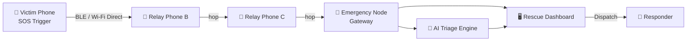

<div align="center">

# 🛡️ ResQMesh

### Offline Emergency Communication & Response Network

*"When the network goes down, ResQMesh turns the people around you into the network."*

[]()
[]()
[]()
[]()
[]()

**[🚀 Live Demo](#-live-demo)** • **[🎥 Demo Video](#-demo-video)** • **[📖 How It Works](#-how-it-works)** • **[🏗️ Architecture](#️-architecture)** • **[👥 Team](#-team)**

</div>

---

## 🚨 The Problem

Every major emergency in India shares one brutal pattern: **the network fails exactly when people need it most.**

- Floods, earthquakes and fires knock out cell towers and Wi-Fi within minutes.
- Dense crowds (protests, stampedes, large events) overload cellular networks even when towers are standing.
- In that blackout window, a phone with 100% battery and zero signal is just an expensive brick — and so is every SOS app that depends on the internet to work.

**Existing offline-mesh apps (Bridgefy, FireChat, Briar) solve the transport problem — sending a message without internet — but stop there.** None of them triage severity, none of them give responders a dashboard, and none of them are built around emergency response as a workflow.

## 💡 The Solution

ResQMesh turns every nearby phone into a relay node. When a user presses SOS:

1. An encrypted packet is created locally — no internet required.
2. It hops phone-to-phone through a Bluetooth/Wi-Fi Direct mesh until it reaches an **Emergency Node** (police station, hospital, shelter, or rescue vehicle) with real connectivity.
3. An **AI triage layer** classifies severity (Critical / High / Normal) — in parallel, never blocking the SOS itself.
4. A **live rescue dashboard** shows responders exactly what's happening, where, and how urgently — with one click to dispatch.

Women's safety is one emergency mode among several — flood, fire, earthquake, accident, medical, and personal safety all run through the same pipeline.

---

## 🚀 Live Demo

> **Demo link:** https://resqmesh-t76o.onrender.com/

Open the link on two tabs — one as the "victim" screen (`/`), one as the "rescue dashboard" (`/dashboard`) — to see the full SOS → mesh relay → AI triage → dispatch flow live.

## 🎥 Demo Video

> **Video link:** https://drive.google.com/file/d/1fxt_aqTWFMLHZOIY2vguSW_vrzrWs7fq/view?usp=drivesdk

A 60–90 second walkthrough: SOS triggered on the victim screen → packet visibly hops through the simulated mesh → arrives at the Emergency Node → AI tags it CRITICAL → responder dispatches help on the live dashboard.

---

## 📖 How It Works

| Step | What happens | Mechanism |
|---|---|---|
| **0. Setup** | User installs the app, downloads an offline map, adds emergency contacts, enables Relay Mode | One-time onboarding |
| **1. Trigger** | User presses SOS → 3-second cancellable countdown → encrypted packet created | Local packet creation, no internet needed |
| **2. Broadcast** | Packet broadcasts to nearby devices in range | Bluetooth LE / Wi-Fi Direct |
| **3. Multi-hop relay** | Nearby phones (Relay Mode) forward the packet, preferring higher-battery nodes | Store-and-forward, TTL, duplicate detection, battery-aware routing |
| **4. Gateway** | Packet reaches a fixed Emergency Node with real connectivity | Hybrid mesh + gateway architecture |
| **5. AI triage** | Backend classifies severity — runs in parallel, never blocks sending | Rule-based / ML severity classifier |
| **6. Rescue dashboard** | Responders see the case live: location, priority, battery, hop count | Real-time web console with live map |
| **7. Resolution** | Responder dispatches help, marks the case resolved; record auto-expires | Status lifecycle + privacy-by-design data expiry |

---

## 🏗️ Architecture



**Four layers:**

1. **Victim / Relay App** — SOS UI, mesh radio, local encryption, offline map
2. **Dynamic Mesh** — multi-hop routing, TTL, dedupe, battery-aware path selection
3. **Emergency Node Gateway** — fixed bridge points with real connectivity
4. **AI Triage + Rescue Dashboard** — severity classification, live map, dispatch workflow

> This hackathon build simulates the mesh layer in software (multiple virtual nodes over Socket.IO) rather than real device-to-device Bluetooth, so the full workflow can be demoed reliably in one browser session. See [Roadmap](#-roadmap) for the production path.

---

## 🛠️ Tech Stack

| Layer | Technology |
|---|---|
| Frontend | React + Vite + Tailwind CSS |
| Maps | Leaflet / react-leaflet |
| Realtime | Socket.IO |
| Backend | Node.js + Express |
| AI Triage | Rule-based keyword classifier (LLM-upgradeable) |
| Data | In-memory store with auto-expiry (privacy by design) |

---

## ⚡ Getting Started

```bash
# Clone the repo
git clone https://github.com/theaditigarg25-ops/resQmesh.git
cd resQmesh

# Install dependencies and run client + server together
npm install
npm run dev
```

- Client: `http://localhost:5173`
- Server: `http://localhost:4000`
- Rescue dashboard: `http://localhost:5173/dashboard`

See [`CONTRACT.md`](./CONTRACT.md) for the full Socket.IO event and REST API reference shared across the codebase.

---

## 🔍 Why ResQMesh Is Different

| Product | What it does | Where it stops short |
|---|---|---|
| **Bridgefy** | Bluetooth mesh messaging, 12M+ downloads, used during the 2017 Mexico City earthquake | General-purpose chat — no severity triage, no rescue dashboard |
| **FireChat** | Pioneered mesh chat over Bluetooth/Wi-Fi Direct | Servers shut down — proves pure mesh-chat isn't sustainable alone |
| **Briar** | Privacy-first mesh + Tor sync messaging | Built for secure conversation, not structured emergency response |
| **GoTenna** | Dedicated mesh-radio hardware, real long range | Requires buying separate hardware per person |
| **ResQMesh** | SOS trigger → mesh relay → AI triage → dispatchable rescue dashboard | *No existing product combines all four — that's the actual innovation* |

---

## 🗺️ Roadmap

- [ ] **Phase 1:** Campus pilot (dense mesh coverage with real devices)
- [ ] **Phase 2:** Physical Emergency Nodes at partner police stations / hospitals / shelters
- [ ] **Phase 3:** Authorised integration with 112 / ERSS for verified dispatch
- [ ] **Phase 4:** iOS support, solar-powered field relay nodes, voice-triggered SOS, multilingual AI triage
- [ ] **Phase 5:** Extend the mesh pipeline beyond emergencies — rural connectivity, large events

---

## 👥 Team

| Name | Role |
|---|---|
| **Aditi Garg** | Backend Engineering + AI Triage — mesh relay simulation engine, severity classifier, data layer |
| **Divyansh Singh** |Frontend Development — victim / SOS app screen build  |
| **Ayush Mittal** |  UI/UX Design — victim SOS flow and interaction design|
| **Avika Agarwal** | Rescue Dashboard + Presentation — live map, dispatch console, pitch deck |

Built for **[Build With Bharat 2.0] 2026** — Open Innovation Track.

---

<div align="center">

*ResQMesh is a hackathon prototype. Production deployment would require institutional partnerships for Emergency Node placement and authorised emergency-service integration.*

</div>
